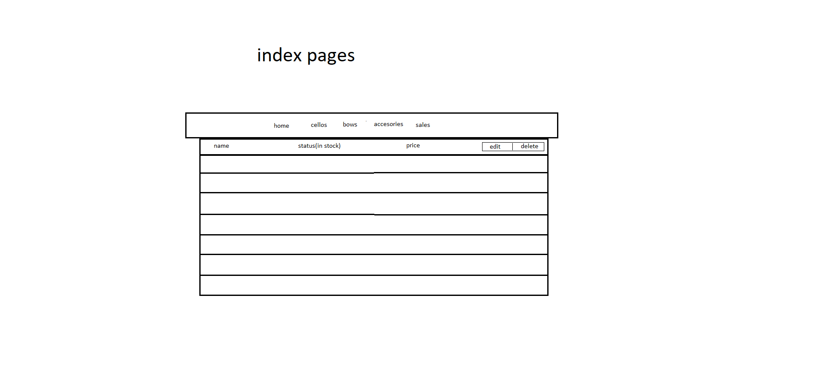
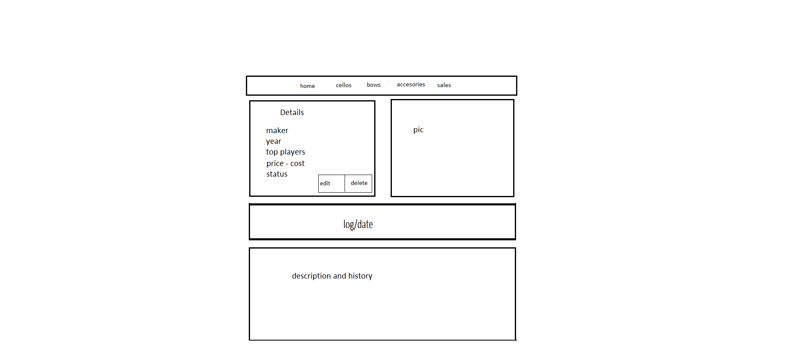
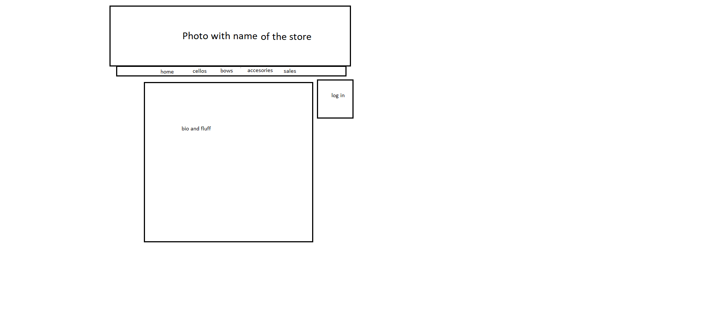

Portfolio page:

The shop has a bunch a very expensive cellos that they would want to be sold in a separate 'executive' shop. very very high brow. design is very important to score the gig and that's why i referenced Bishop. my css is quite bad and my design sense is not good. if you're more creative and good with css we could try... 

MVP Scope
Target audience: Cello/classical music instrument store manager
Purpose of the App: to manage inventories

* Stylized Home, Index, and detail pages of the products
* MongoDB with cellos, bows, accessories, makers, employees collections
* Full CRUD functionality for cellos, bows, accessories

User Stories

* Wireframe and ERD what the app pages will look like. (7/10)
* create data samples for cellos, bows, accessories, makers, employees (7/11 - LN)
* Create a first HTML template for a Header/nav/logo page (DashBoard /home) (7/11 - TSY)
* Create a first HTML template for a Home page (DashBoard /home) (7/11 - TSY)
* Create a first HTML template for a product index page with edit and delete buttons on each product (7/11 - TSY)
* Create a first HTML template for a product detail page with edit and delete buttons (7/11 - LN)
* Create a first HTML template for a product add/edit form page with ability to add new maker (7/11 - LN)
* Write a server route to serve the Home page (7/12)
* Create a schema for cellos, bows, accessories, makers, employee include defining properties (7/12)
* CREATE a page / form / route to create a product in the database. (7/12)
* Create GET a page / route to get a product in the database. (7/12)
* Create UPDATE page / form / route to update a product in the database. (7/12)
* Create DELETE route to delete a product in the database. (7/12)
* Serve the Home page and populate it with information from the database. (7/13)
* Serve the Index pages and populate them with information from the database. (7/13)
* Serve the Detail pages and populate them with information from the database. (7/13)
* Beautify Home page (7/14)
* Beautify Index pages (7/14)
* Beautify Detail pages (7/14)
* DRYing code (7/14)

Enhancements

* Responsive design (mobile friendly)
* Front-end form validation
* Front-end user validation/access control (login page and authentication)
* Sales data and dashboard page
* Industry related news
* Classical music events (links to event, youTube, etc.)
* A page for auctioning products
* Auction events to attend 
* Shop events
* employess details (names, salaries, strat date, etc)

Technology

* Express, MongoDB, Mongoose, Javascript, HTML, CSS, Node.js, Bootstrap

Wireframes

Dashboard... 

Product Index page...

Prodcut Show page...

Add/edit...

future enhancement - loging page

ERD

Databases

cellos = ({
* title: {type: String}, // 'some fancy name'; but prefered hue hue,
* year: {type: Number, required: true}, // 1650
* type: {type: String, required: true}, // 'cello', 'future product'
* price: {type: Number, required: true},
* cost: {type: Number, required: true},
* status: {type: String, required: true}, // 'in stock', 'sold out', 'repair'
* quantity: {type: Number, required: true},
* players: [String], // ['this will display a list of famous players']
* description: String, // 'history of the cello in proze'
* photo: String, // 'urls',
* maker: [{
*   type: mongoose.Schema.Types.ObjectId,
*   ref: 'Maker'
* }],
* timeStamp
})

accesories = ({
* name: {type: String, required: true}, // {Makers.name}
* brand: String,
* price: {type: Number, required: true},
* cost: {type: Number, required: true},
* status: {type: String, default: 'in stock'}, // 'in stock', 'sold out'
* quantity: {type: Number, required: true},
* type: String, // generic name (i.e. bows, case, etc.)
* description: String,
* photo: String, // 'urls', 
* forInstrument: [String], // 'cello'
* timeStamp
})

makers = ({
* name: {type: String, required: true}, // {Makers.name}
* bio: String,
* photo: String, //'urls', 
})

employees = ({
* name: {type: String, required: true}, // 'Darth Vader' 
* Title: String,  // 'manager'
* password: {type: String, required: true},
* access: {type: Boolean, required: true},
* accessLevel: {type: String, required: true}, // 'full access', 'view only'
})

